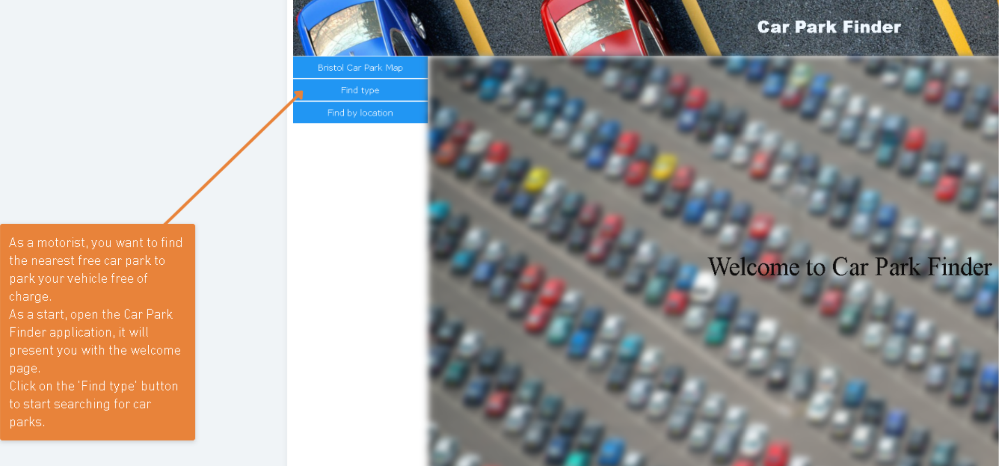
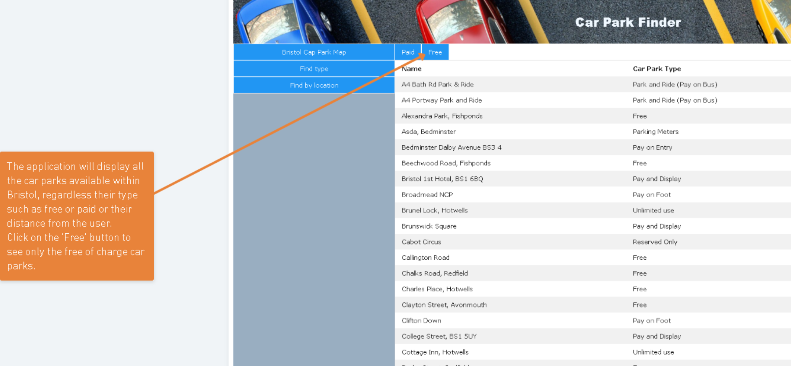
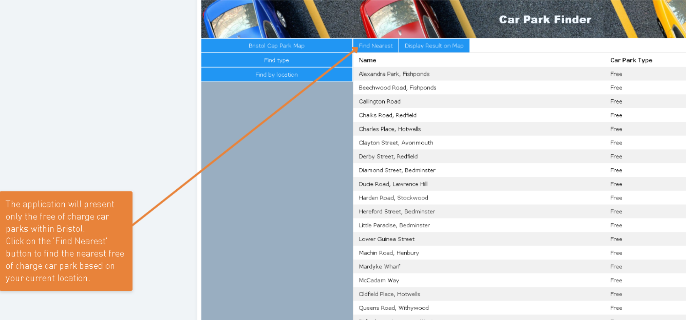
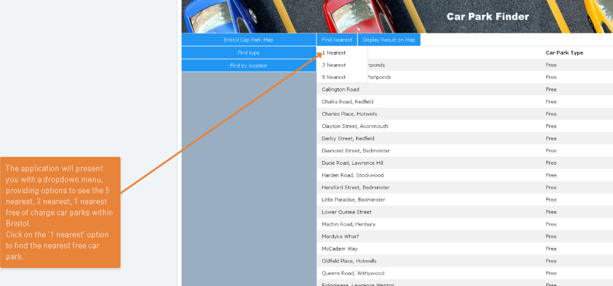
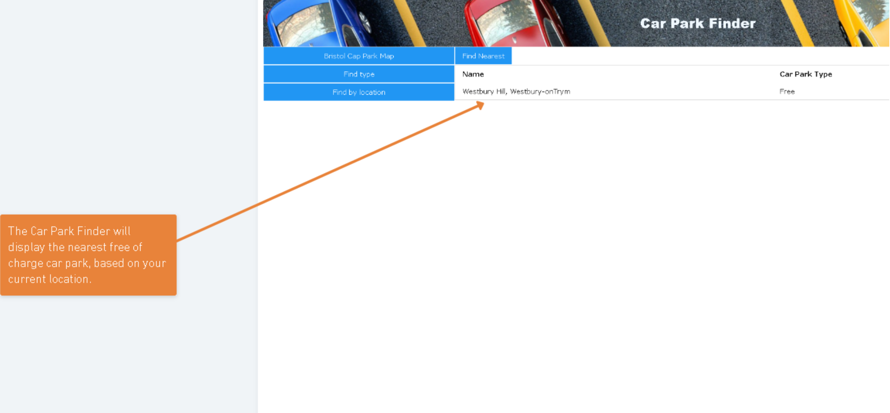
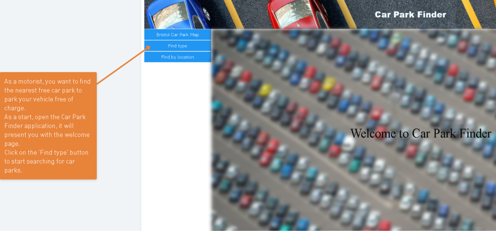
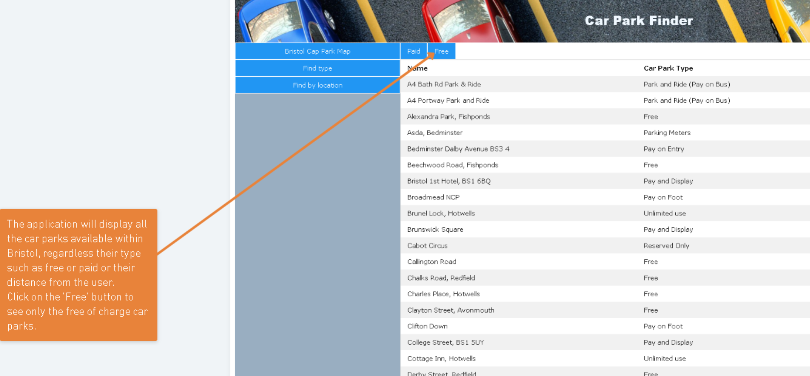
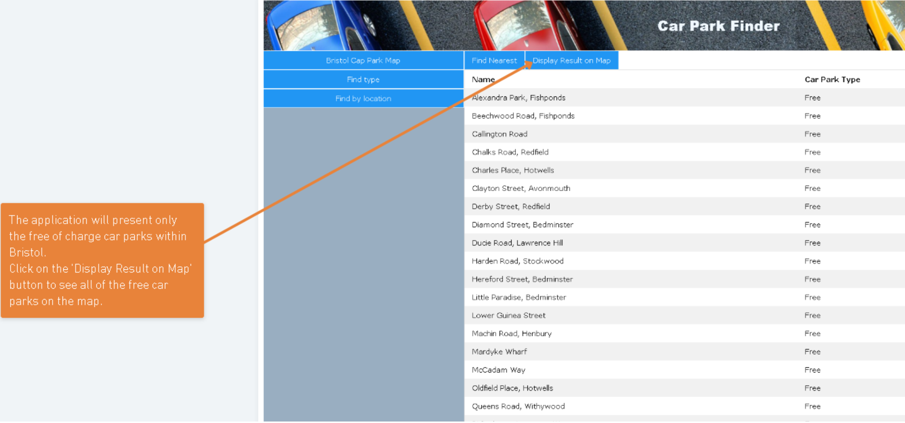
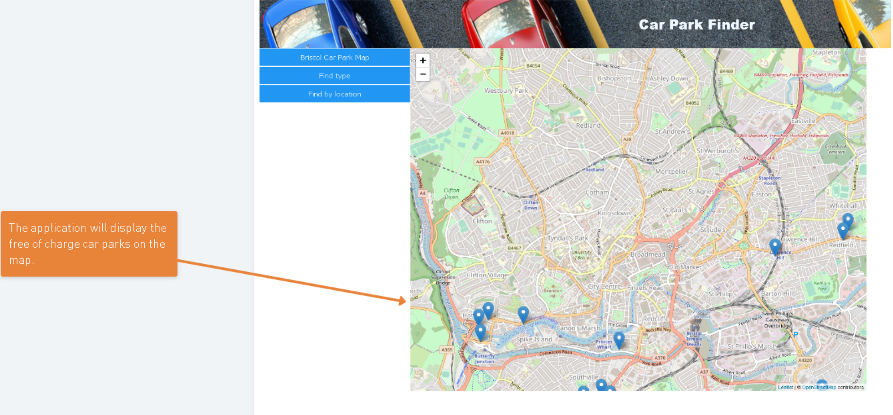

# Deployment

## Release Notes

The current version of the system is v1.0-alpha. The system dependencies are Express, EJS and MySQL. The software tools used are Mocha test framework and TestCafe end-to-end web testing tool. As of the 9th of May 2021, there are no known issues in the application. The URL of the application is pasted below:-

http://localhost:8080/

The deployment diagram of the application is presented below:-

# User guide

An user guide is presented for each use-case. The aim of the guide for all use-cases is to help the user to utilize the features of the program that facilitates the use-case. The guides are:-

### UC1: As a motorist, I want to view car parks in a certain area or all car parks in Bristol, so that I can choose a suitable one to park my car.

In accordance with this use-case, the user can either view all car parks in a specific area or all car parks in Bristol. A user guide to accomplish both these objectives are listed below:-

1) For viewing all car parks in a specific area

.png)

.png)

2) For viewing all car parks in Bristol

.png)

.png)

### UC2: As a motorist I want to find car park on a map.

### UC3: As a motorist, I want to find the nearest free car park so that I can park my vehicle for free of charge

The following set of screenshots represents an user guide to achive the objective of locating the nearest free of charge car park in Bristol.

Alternatively, the application allows us to obtain a visual representation of the free of charge car parks within Bristol. 
The following set of screenshots represents the user guide to achieve the objective of displaying all the free of charge car parks in the Bristol area.

