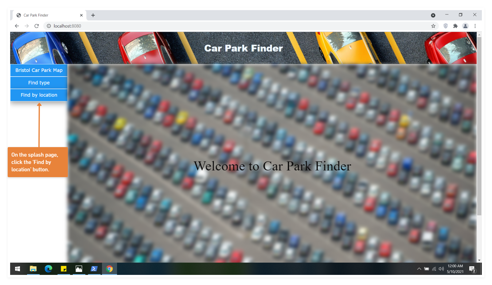

# Deployment

## Release Notes
TODO: Describe the current version of the system (with version number. Include system dependencies ands software tools used.
Are there any known issues? Provide the URL of the deployed system. 
Describe the deployment of software components to hardware nodes using a UML Deployment diagram.

The current version of the system is v1.0-alpha. The system dependencies are express, ejs, mysql, save-dev. The software tools used are save-dev mocha and save-dev testcafe. As of the 9th of May, there are no known issues in the application. The URL of the application is pasted below:-

http://localhost:8080/

The deployment diagram of the apllication is presented below:-

# User guide

A user guide is presented for each use-case. The aim of the guide for all use-cases is to help the user to utilize the features of the program that facilitates the use-case. The guides are:-

UC1: As a motorist, I want to view car parks in a certain area or all car parks in Bristol, so that I can choose a suitable one to park my car.

In accordance with this use-case, the user can either view all car parks in a specific area or all car parks in Bristol. A user guide to accomplish both these objectives are listed below:-

1) For viewing all car parks in a specific area

.png)

.png)

2) For viewing all car parks in Bristol

.png)

.png)

UC2: As a motorist I want to find car park on a map.

TODO: Repeat as necessary
