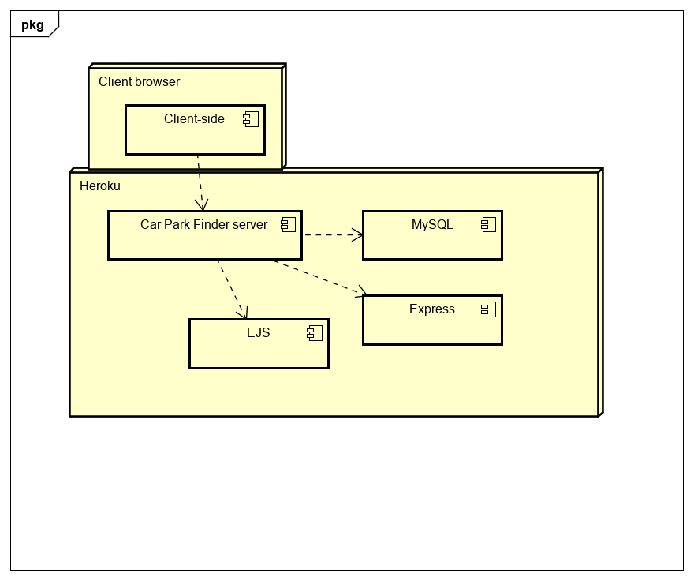
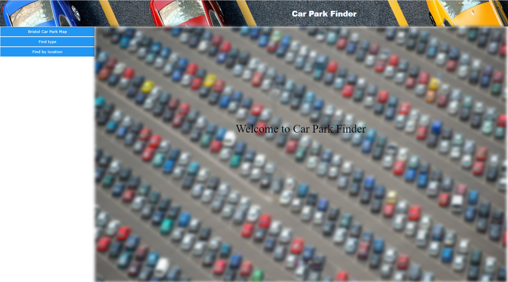
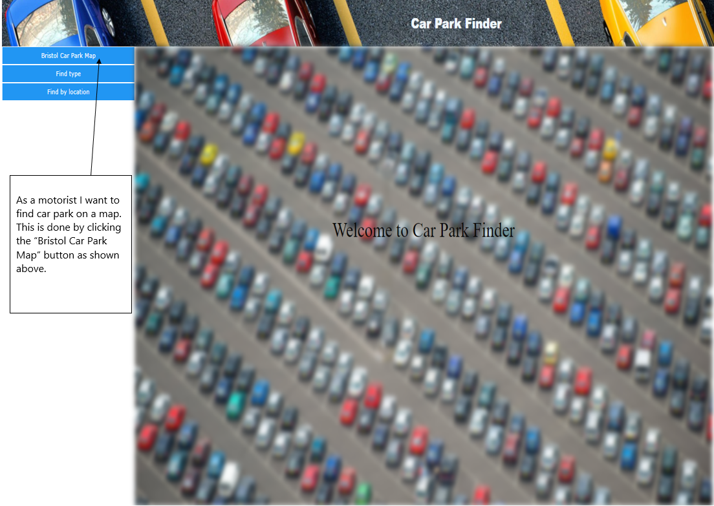
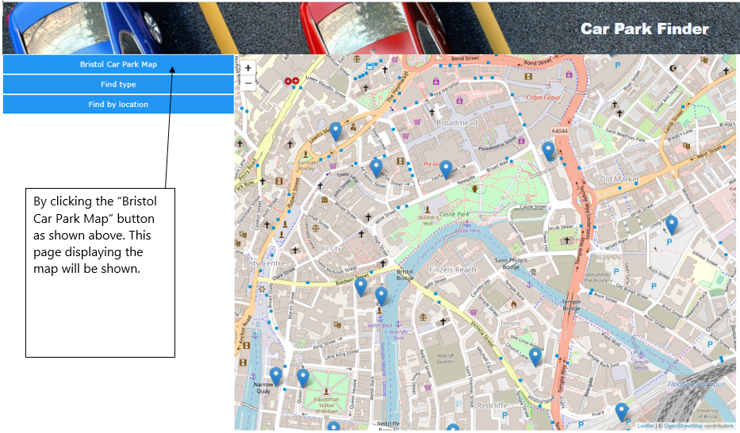

# Deployment

## Release Notes
TODO: Describe the current version of the system (with version number. Include system dependencies ands software tools used.
Are there any known issues? Provide the URL of the deployed system. 
Describe the deployment of software components to hardware nodes using a UML Deployment diagram.

v1.0-alpha

http://localhost:8080/

# User guide

UC2: As a motorist I want to find car park on a map.

TODO: Repeat as necessary
