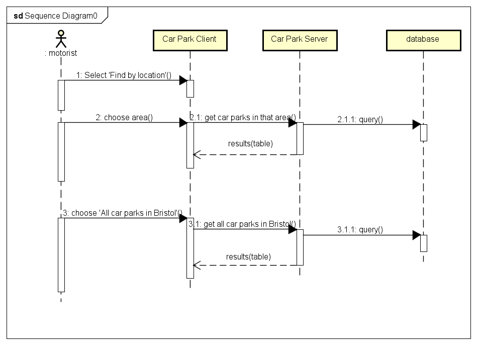

# Design

## Behavioural design
UC1: A motorist wants to view all the car parks in a desired area in Bristol, in a table. 

UC2: As a motorist I want to find car park on a map.

UC3: A motorist wants to get information about car parks nearby, free of charge car parks nearby and the location of the free of charge car parks displayed on the map, based on the motorist whereabouts and the initally set range in distance.

## User Interface design
UC1: A motorist wants to view all the car parks in a desired area in Bristol, in a table. Alternatively, the user wants to view information about all car parks in Bristol.

UC2: A motorist wants to find all the car parks in a particular area shown to them on a map.

UC3: A motorist wants to get information about car parks nearby, free of charge car parks nearby and the location of the free of charge car parks displayed on the map, based on the motorist whereabouts and the initally set range in distance.

