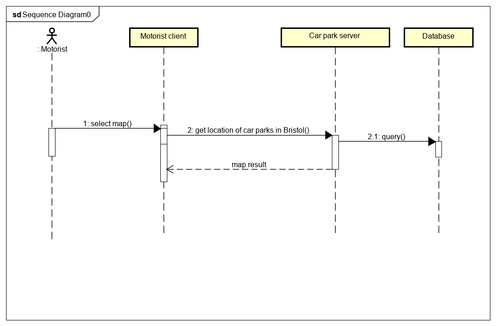

# Design

## Behavioural design
UC1: A motorist in Bristol wants to enter his postcode into the application and view the information of the nearest car park. 

UC2: A motorist wants to enter a particular location into the app and have the closest car park shown to them on a map.

UC3: A motorist wants to get information about car parks nearby, free of charge car parks nearby and the location of the free of charge car parks displayed on the map, based on the motorist whereabouts and the initally set range in distance.

## User Interface design
TODO: Specify and develop a user interface mockup using an HTML wireframe.

TODO: repeat as necessary

