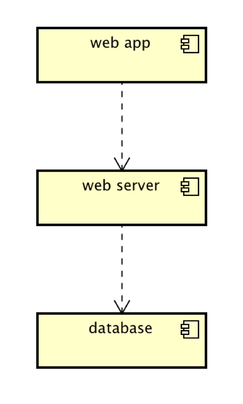

# Implementation

## Introduction
The current version of the Car Park Tracker application is version 1.0-alpha. It uses a simple user interface to allows the user to view car parks in an area of Bristol in a table, view all car parks in Bristol on a table or a map, and view car parks by type (free or paid). Minor bug fixes will be corrected and updated as a new patch, for example. v1.0-beta.   If a major change is decided, such as addition of a new functionality, a newer version will be released, such as v1.1-alpha. The dataset consists of the information about all car parks in Bristol, such as their name, capacity, geo-location, etc, imported from Open Data Bristol. There are no known issues of this program at this date (May 8 2021).  For accessing the database for the application in mysql, each creator has a separate login credential (username and password), which is relevant only to themselves. Therefore, the individual login credentials have been saved in a file called conf.json in each of the creator's local directory and have not been added to the repository.

## Project Structure
```
├── docs                (Contains documents about the different stages of software development(planning, requirement, design, implementation, testing and deployment))
├── e2e                 (Contains end-to-end tests for different use cases)
├── node_modules        (Contains the directories of all the other applications used in the development process)
├── static              (Contains the static content used in the pages of the application, for example images)
├── test                (Contains unit test)
├── views               (Contains the template-pages used for the application)   
├── .gitignore          (Specifies all the files that are not added to gitHub repository)
├── conf.json           (Specifies mySQL configuration for individual creator, ignored by git(gitignore))
├── main.js             (The main file of the developed system. Contains the code to run the system.)
├── package.json        (Lists all the node dependencies of the system)    
├── package-lock.json   (Lists all dependencies in package.json in full-detail)
├── readme.md           (Brief note by the creators to the users of the system)
```

## Software Architecture
Three- tier software architecture is used in the development of this application.


