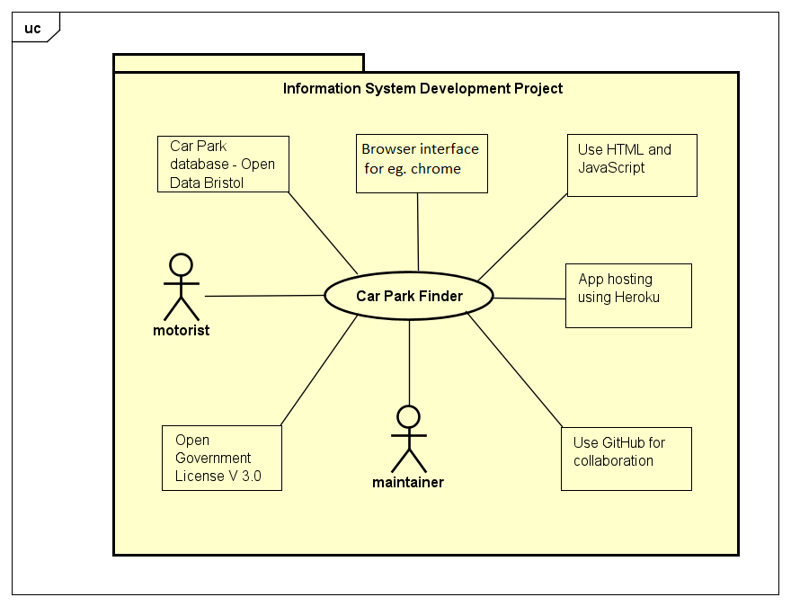

# Project Proposal

## Business Case

### Problem statement
Team UML aims to develop a way for citizens and visitors to easily find somewhere to park their vehicles quickly and efficiently. The Car Park Locator application is the realization of this goal, it is a simple way for its users to find the closest car park to them or a desired location.

### Business benefits
The Car Park locator application is for anyone who wants to find a car park at a specific location. This could be anyone either inside or outside of Bristol, who needed the information now or in the future. Beneficial information that will be included in the application will be car park type, number of spaces and operating times. 

### Options Considered
Other possible options include using google map's search for 'car parks near me' or asking an individual to point you to the nearest car park. Google maps display a lot of information besides car parks which may be irrelevant to the user. This creates clutter and confusion and may mislead the user. When we ask an individual, there is no guarentee that the person knows the nearest car park. Even if the person knows the location, the directions can not be relayed as clearly and precisely as by using a map.

### Expected Risks
The app points the user to the nearest car park. However, the app can not check or verify the number of parking spots available at a particular time. Therefore, there is a chance that the car park directed by the app may not have any parking spots left. In that case, the user may have to wait to find a spot and lose valuable time. In addition to that, the determining factor of the app's suggestion is purely distance. Hence from a choice of one park that is 1.5 miles from the user and takes an average of 20 minutes to navigate due to the traffic and another park 1.6 miles from the user that takes 10 minutes, the former car park is suggested, despite the latter being a more sensible choice for the user.

## Project Scope
* This project will consist of creating a mobile based application using HTML and JavaScript, that asks the user to input the desired postcode within Bristol and returns the location of the nearest car park to the user on a map.
* The project will use Car Park database from Open Data Bristol in order to acess the information required to enable the app to perform it's task. Examples include all the information about numerous car parks in Bristol and the map to represent it. The use of the database in the project is approved by the government with government license V 3.0. [(The license)](http://www.nationalarchives.gov.uk/doc/open-government-licence/version/3/)
* HTML and JavaScript will be used to create the application suitable for android/ios interface. This is done by keeping in mind that the device almost always used by users to search for car parks will be their mobile phones.
* During the project, the collaborators will use GitHub to store and have common acess to the directory files of the program. The application will be hosted in Heroku.
* After the release of the application, if a bug is found either by the collaborators or by the users, the collaborators, after recieving the information about this bug, will locate the error in their program directory and will fix the bug.
* The application will only provide the information of the car parks within Bristol. A validator will be used that only allows the postcode within Bristol to be input by the user. If a postcode is not valid or is outside Bristol, an error message is displayed. This is done in order to keep up with the very specific aim of the program (to provide the nearest car park location to a motorist within Bristol.)
* 

### The context diagram for the project is displayed below :-

